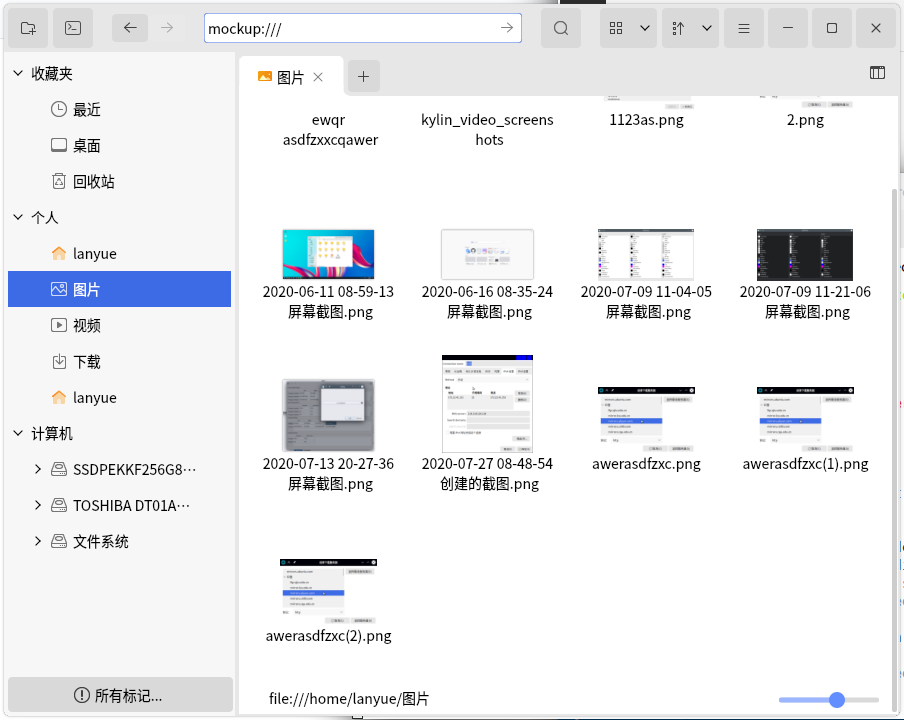
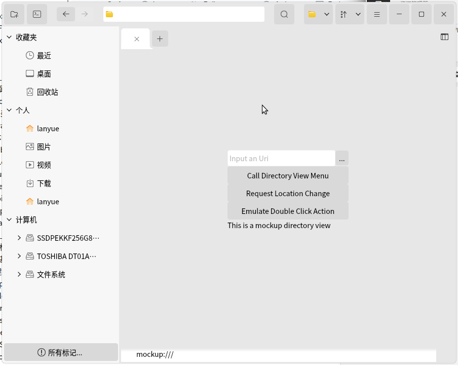
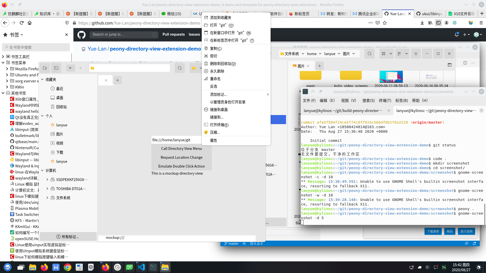

# peony-directory-view-extension-demo
A demo and template for peony directory view extensions.

# build and test (on UbuntuKylin 20.04)
> git clone https://github.com/Yue-Lan/peony-directory-view-extension-demo.git

> sudo apt build-dep peony-extensions

> mkdir build && cd build

> qmake ..

> sudo make install

# screenshot

## entry

## mockup view

## call menu
